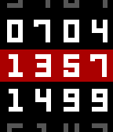

# roidelapluie watchface

Based on [Static-Enigma](https://github.com/exiva/Static-Enigma). Original design by Alex Kirov and watchface published by Neal Patel.

Licensed under GPLv2.

## Features

* Not configurable
* Vibes on connection changes

Rows:

* Date
* Hour with a red background, grey when not connected to the phone
* Week number + (99 if charge is 100) or (RANDOM<5 + Battery charge/10)

## Screenshot

